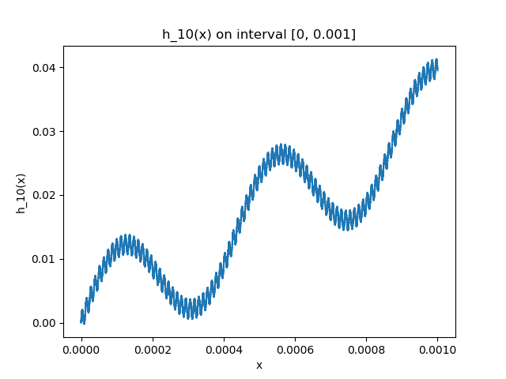
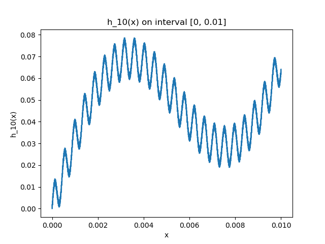
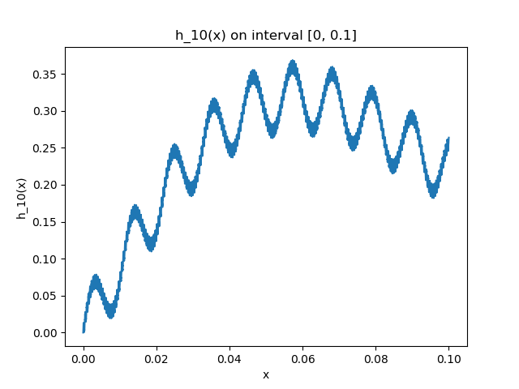
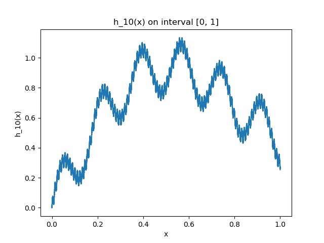

# Computer Project 1
Nicolas Perez

Prof. Sergey Lototsky

## Problem 1
### Part 1
Graphs:









Program:
```
import matplotlib.pyplot as plt
import numpy as np
from math import factorial, sin
import pandas as pd


def h10(x: int):
    count = 0
    for i in range(1, 11):
        count += sin((factorial(i) ** 2) * x) / factorial(i)

    return count


"""
interval: (tuple) containing boundaries for x
steps: (int) number of datapoints to generate
"""
def plot_h10(interval: tuple, steps: int):
    result = {}
    samples = np.linspace(interval[0], interval[1], num=steps)
    for x in samples:
        result[x] = h10(x)

    result = pd.Series(result)

    fig = plt.figure()
    ax = plt.subplot(111)
    ax.plot(result)
    ax.set_xlabel('x')
    ax.set_ylabel('h_10(x)')
    ax.set_title('h_10(x) on interval [{}, {}]'.format(interval[0], interval[1]))
    fig.savefig('h10_[{}_{}].png'.format(interval[0], interval[1]))


def main():
    plot_h10((0, 1), 10000)
    plot_h10((0, 0.1), 10000)
    plot_h10((0, 0.01), 10000)
    plot_h10((0, 0.001), 10000)


if __name__ == '__main__':
    main()

```
### Part 2
1. 
